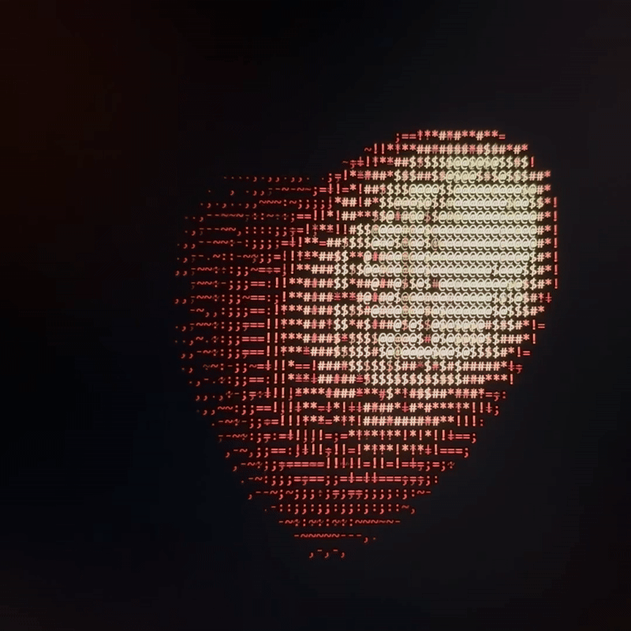

# 3d-ascii-heart
a pink-shaded rotating heart animation, rendered in ASCII characters in the browser. 💖  
built with js.

⭐ [see it in action](https://iqek.github.io/3d-ascii-heart/) 

# how it works
- Computes a 3D heart shape using simple math.
- Projects 3D coordinates to 2D screen positions.
- Uses a z-buffer to handle overlapping parts.
- Shades ASCII characters based on depth to create a pseudo-3D effect.
- Fully runs in the browser.
